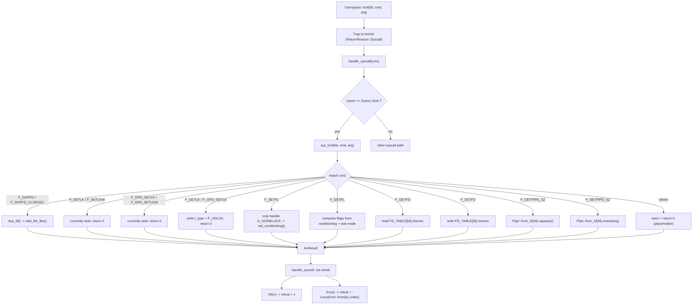

```mermaid
flowchart TD
U["Userspace: fcntl(fd, cmd, arg)"] --> T["Trap to kernel (ReturnReason::Syscall)"]
T --> H["handle_syscall(uctx)"]
H --> D{"sysno == Sysno::fcntl ?"}
D -->|yes| F["sys_fcntl(fd, cmd, arg)"]
D -->|no| X["other syscall path"]

F --> C{"match cmd"}
C -->|F_DUPFD / F_DUPFD_CLOEXEC| C1["dup_fd() -> add_file_like()"]
C -->|F_SETLK / F_SETLKW| C2["currently stub: return 0"]
C -->|F_OFD_SETLK / F_OFD_SETLKW| C3["currently stub: return 0"]
C -->|F_GETLK / F_OFD_GETLK| C4["write l_type = F_UNLCK; return 0"]
C -->|F_SETFL| C5["only handle O_NONBLOCK -> set_nonblocking()"]
C -->|F_GETFL| C6["compose flags from nonblocking + stat mode"]
C -->|F_GETFD| C7["read FD_TABLE[fd].cloexec"]
C -->|F_SETFD| C8["write FD_TABLE[fd].cloexec"]
C -->|F_GETPIPE_SZ| C9["Pipe::from_fd(fd).capacity()"]
C -->|F_SETPIPE_SZ| C10["Pipe::from_fd(fd).resize(arg)"]
C -->|others| C11["warn + return 0 (placeholder)"]

C1 --> R["AxResult<isize>"]
C2 --> R
C3 --> R
C4 --> R
C5 --> R
C6 --> R
C7 --> R
C8 --> R
C9 --> R
C10 --> R
C11 --> R

R --> S["handle_syscall: set retval"]
S --> OK["Ok(v) -> retval = v"]
S --> ER["Err(e) -> retval = -LinuxError::from(e).code()"]
```
