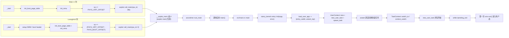

```mermaid
flowchart LR
  subgraph RV["RISC-V 列"]
    RV0["_start"] --> RV1["init_boot_page_table"]
    RV1 --> RV2["init_mmu"]
    RV2 --> RV3["sp += PHYS_VIRT_OFFSET"]
    RV3 --> RV4["axplat::call_main(cpu_id, dtb)"]
  end

  subgraph LA["LoongArch 列"]
    LA0["_start"]
    LA0 --> LA1["setup DMW / boot header"]
    LA1 --> LA2["init_boot_page_table + init_mmu"]
    LA2 --> LA3["sp += (PHYS_VIRT_OFFSET - PHYS_BOOT_OFFSET)"]
    LA3 --> LA4["axplat::call_main(cpu_id, 0)"]
  end

  RV4 --> C0["__axplat_main (由 #[axplat::main] 生成)"]
  LA4 --> C0

  C0 --> C1["axruntime::rust_main"]
  C1 --> C2["调用应用 main()"]
  C2 --> C3["src/main.rs::main"]
  C3 --> C4["starry_kernel::entry::init(args, envs)"]
  C4 --> C5["load_user_app -> (entry_vaddr, ustack_top)"]
  C5 --> C6["UserContext::new + new_user_task + spawn_task"]
  C6 --> C7["axtask 调度切换到该任务"]
  C7 --> C8["TaskContext::switch_to / context_switch"]
  C8 --> C9["new_user_task 闭包开始"]
  C9 --> C10["while !pending_exit"]
  C10 --> C11["第一次 uctx.run() 进入用户态"]

```